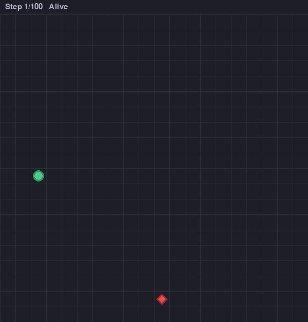
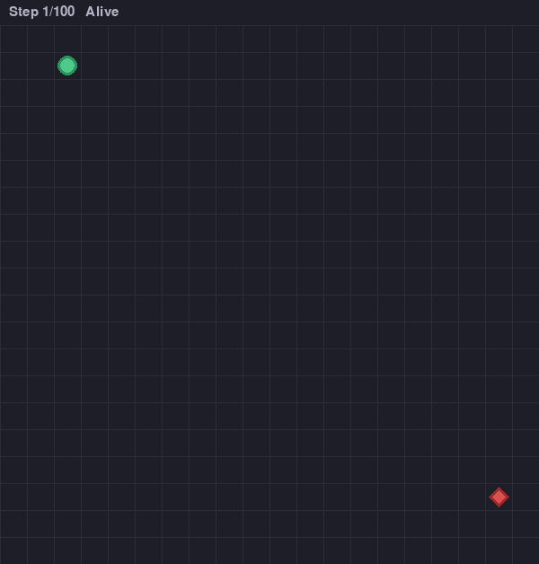
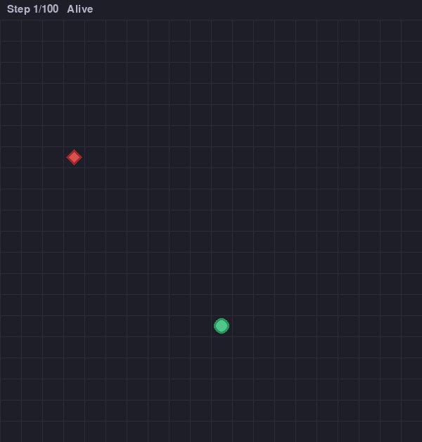
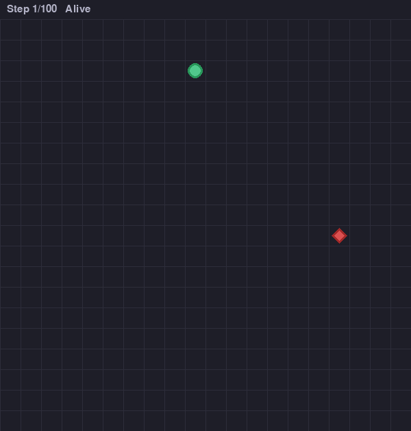

# Predator-Prey Reinforcement Learning

A 1v1 hide-and-seek environment where a predator learns to catch a prey, and the prey learns to escape.

## Overview

Multi-agent reinforcement learning environment using PPO. Study emergent behaviors in adversarial settings.

### Environment

- **Grid:** 20x20
- **Agents:** 1 predator (red triangle) + 1 prey (green circle)
- **Episode:** 100 steps max
- **Observations:** Positions and distances (8 dimensions)
- **Actions:** Stay, Up, Down, Left, Right

### Rewards

**Predator:** -1/step, +100 catch, +proximity bonuses
**Prey:** +1/step, -100 caught, +50 survival, +distance bonuses

## Files

```
environment.yml     # Conda dependencies
config.py          # Parameters
environment.py     # Gym environment
utils.py           # Wrapper and helpers
train.py           # Training script
evaluate.py        # Evaluation script
```

## Installation

```bash
conda env create -f environment.yml
conda activate predator-prey-rl
```

## Usage

### Training

```bash
python train.py predator
python train.py prey
```

**Outputs:**
- Models: `models/{agent}_final.zip`
- Metrics: `training_metrics/{agent}/progress.png`
- Stats: `training_metrics/{agent}/stats.txt`

### Evaluation

```bash
python evaluate.py
python evaluate.py --predator models/predator_final.zip
python evaluate.py --predator models/predator_final.zip --prey models/prey_final.zip
```

**Outputs:**
- GIFs: `evaluation/{name}_{timestamp}/ep*.gif`
- Summary: `evaluation/{name}_{timestamp}/summary.txt`

## Results

| Random vs Random | Trained Predator | Trained Prey | Both Trained |
|:---:|:---:|:---:|:---:|
|  |  |  |  |
| Baseline | Predator learns pursuit | Prey learns evasion | Full adversarial |

With 100k timesteps:
- Catch rate: ~25%
- Episode length: ~90.4 steps

## Future Directions

- Multiple prey (2-3 agents)
- Obstacles and walls
- Partial observability (vision cones)
- Different prey strategies
- Curriculum learning